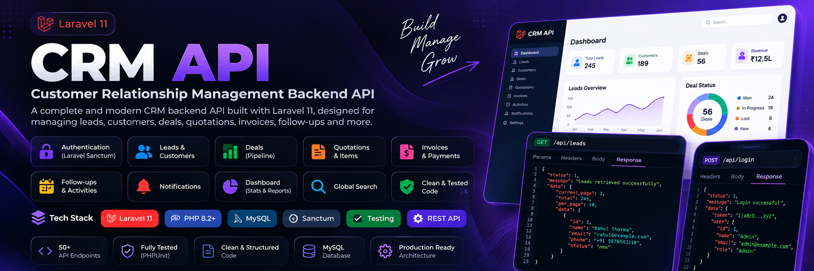

<p align="center">
  
</p>


# CRM API

Laravel 11 based Customer Relationship Management (CRM) backend API.

This project provides REST APIs for authentication, leads, customers, follow-ups, activities, notes, tasks, deals, quotations, invoices, payments, notifications, dashboard reporting, and global search.

=======
## Tech Stack

>>>>>>> 8575389fc6325b3d27cc0f6aee24e75def8cd355
- **PHP:** 8.2+
- **Framework:** Laravel 11
- **Authentication:** Laravel Sanctum
- **Database:** MySQL
- **API Style:** REST API
- **Testing:** Laravel Feature Tests

## Main Features

- Authentication with Laravel Sanctum
- Country, State and City management
- Category management
- Lead management and lead conversion
- Customer management
- Customer contacts with primary-contact support
- Follow-up management
- Activity management
- Notes management
- Task management
- User assignment and notifications
- Deal and pipeline management
- Deal stage history
- Quotation management
- Quotation items
- Quotation to invoice conversion
- Invoice management
- Invoice status history
- Invoice payments
- Payment validation and invoice paid status handling
- Dashboard statistics and reports
- User-wise sales, tasks, follow-ups, quotations, invoices, activities, notes and leads
- Deal forecast and win-rate reports
- Lead source summary
- Monthly revenue report
- Invoice aging
- Global search across CRM modules
- Feature testing

## Project Structure

```text
app/
├── Http/
│   └── Controllers/
├── Models/
└── Helpers/

database/
├── migrations/
└── seeders/

routes/
└── api.php

tests/
├── Feature/
└── Unit/

API_DOCUMENTATION.md
README.md
```

## Installation

### 1. Clone the repository

```bash
git clone https://github.com/USERNAME/crm-api.git
cd crm-api
```

Replace `USERNAME/crm-api` with your actual GitHub repository URL.

### 2. Install dependencies

```bash
composer install
```

### 3. Configure environment

Copy the example environment file.

On Windows PowerShell:

```powershell
Copy-Item .env.example .env
```

Generate the application key:

```bash
php artisan key:generate
```

Configure your database credentials in `.env`.

Example:

```env
DB_CONNECTION=mysql
DB_HOST=127.0.0.1
DB_PORT=3306
DB_DATABASE=crm
DB_USERNAME=root
DB_PASSWORD=
```

### 4. Run migrations

```bash
php artisan migrate
```

### 5. Start the development server

```bash
php artisan serve
```

Default local URL:

```text
http://127.0.0.1:8000
```

## Authentication

The protected APIs use Laravel Sanctum Bearer Tokens.

Login:

```text
POST /api/auth/login
```

After login, send the returned token in the request header:

```text
Authorization: Bearer YOUR_TOKEN
Accept: application/json
```

Logout:

```text
POST /api/auth/logout
```

## API Modules

### Authentication

```text
POST /api/auth/register
POST /api/auth/login
POST /api/auth/logout
```

### Location

```text
POST /api/country/save
POST /api/country/list
POST /api/country/detail
POST /api/country/update
POST /api/country/delete

POST /api/state/save
POST /api/state/list
POST /api/state/detail
POST /api/state/update
POST /api/state/delete

POST /api/city/save
POST /api/city/list
POST /api/city/detail
POST /api/city/update
POST /api/city/delete
```

### Category

```text
POST /api/category/save
POST /api/category/list
POST /api/category/detail
POST /api/category/update
POST /api/category/delete
POST /api/category/dropdown
```

### Lead

```text
POST /api/lead/save
POST /api/lead/list
POST /api/lead/detail
POST /api/lead/update
POST /api/lead/delete
POST /api/lead/convert
POST /api/lead/my-leads
POST /api/lead/my-leads-summary
```

### Customer

```text
POST /api/customer/save
POST /api/customer/list
POST /api/customer/detail
POST /api/customer/update
POST /api/customer/delete
```

### Customer Contact

```text
POST /api/customer-contact/save
POST /api/customer-contact/list
POST /api/customer-contact/detail
POST /api/customer-contact/update
POST /api/customer-contact/delete
POST /api/customer-contact/set-primary
```

### Follow-Up

```text
POST /api/follow-up/save
POST /api/follow-up/list
POST /api/follow-up/detail
POST /api/follow-up/update
POST /api/follow-up/delete
POST /api/follow-up/my-follow-ups
POST /api/follow-up/my-follow-ups-summary
POST /api/follow-up/upcoming
POST /api/follow-up/overdue
```

### Activity

```text
POST /api/activity/save
POST /api/activity/list
POST /api/activity/detail
POST /api/activity/update
POST /api/activity/delete
POST /api/activity/my-activities
POST /api/activity/my-activities-summary
```

### Notes

```text
POST /api/note/save
POST /api/note/list
POST /api/note/detail
POST /api/note/update
POST /api/note/delete
POST /api/note/my-notes
POST /api/note/my-notes-summary
```

### Task

```text
POST /api/task/save
POST /api/task/list
POST /api/task/detail
POST /api/task/update
POST /api/task/delete
POST /api/task/my-tasks
POST /api/task/my-tasks-summary
```

### Notifications

```text
POST /api/notification/list
POST /api/notification/detail
POST /api/notification/mark-as-read
POST /api/notification/mark-all-as-read
POST /api/notification/unread-count
POST /api/notification/my-notifications
POST /api/notification/my-unread-count
POST /api/notification/my-mark-all-as-read
```

### Deal

```text
POST /api/deal/save
POST /api/deal/list
POST /api/deal/detail
POST /api/deal/update
POST /api/deal/delete
POST /api/deal/my-deals
POST /api/deal/my-deals-summary
POST /api/deal/pipeline-summary
```

### Deal Stage History

```text
POST /api/deal-stage-history/list
POST /api/deal-stage-history/detail
```

### Quotation

```text
POST /api/quotation/save
POST /api/quotation/list
POST /api/quotation/detail
POST /api/quotation/update
POST /api/quotation/delete
POST /api/quotation/my-quotations
POST /api/quotation/convert-to-invoice
```

### Quotation Item

```text
POST /api/quotation-item/save
POST /api/quotation-item/list
POST /api/quotation-item/detail
POST /api/quotation-item/update
POST /api/quotation-item/delete
```

### Invoice

```text
POST /api/invoice/save
POST /api/invoice/list
POST /api/invoice/detail
POST /api/invoice/update
POST /api/invoice/delete
POST /api/invoice/my-invoices
POST /api/invoice/my-invoices-summary
POST /api/invoice/mark-overdue
```

### Invoice Status History

```text
POST /api/invoice-status-history/list
POST /api/invoice-status-history/detail
```

### Invoice Payment

```text
POST /api/invoice-payment/save
POST /api/invoice-payment/list
POST /api/invoice-payment/detail
POST /api/invoice-payment/update
POST /api/invoice-payment/delete
POST /api/invoice-payment/summary
```

### Dashboard

```text
POST /api/dashboard/summary
POST /api/dashboard/sales-by-user
POST /api/dashboard/sales-by-customer
POST /api/dashboard/tasks-by-user
POST /api/dashboard/follow-ups-by-user
POST /api/dashboard/quotations-by-user
POST /api/dashboard/invoices-by-user
POST /api/dashboard/deal-forecast
POST /api/dashboard/deal-forecast-by-user
POST /api/dashboard/lead-source-summary
POST /api/dashboard/monthly-revenue
POST /api/dashboard/activities-by-user
POST /api/dashboard/notes-by-user
POST /api/dashboard/leads-by-user
POST /api/dashboard/quotation-conversion-rate
POST /api/dashboard/quotation-invoice-summary
POST /api/dashboard/invoice-aging
POST /api/dashboard/deal-win-rate
```

### Global Search

```text
POST /api/search
```

Request body:

```text
keyword
per_page
```

`keyword` must contain at least 2 characters.

## Common API Response

### Success

```json
{
    "status": 1,
    "msg": "success message",
    "error": "",
    "error_array": [],
    "data": {}
}
```

### Error

```json
{
    "status": 0,
    "msg": "error message",
    "error": "",
    "error_array": [],
    "data": []
}
```

## Testing

Run the complete test suite:

```bash
php artisan test
```

Run the quotation-item migration test specifically:

```bash
php artisan test --filter=QuotationItemMigrationTest
```

Check migration status:

```bash
php artisan migrate:status
```

## Useful Commands

Clear Laravel caches:

```bash
php artisan optimize:clear
```

Refresh Composer autoload:

```bash
composer dump-autoload
```

List API routes:

```bash
php artisan route:list --path=api
```

## Important Note

This CRM project does **not** contain a Product module.

Quotation Items use:

```text
quotation_id
item_name
quantity
price
total_amount
```

Quotation Items do not use `product_id` or a `products` table.

## API Documentation

Detailed endpoint documentation is available in:

```text
API_DOCUMENTATION.md
```

## Git Workflow

Check changes:

```bash
git status
```

Stage changes:

```bash
git add .
```

Commit:

```bash
git commit -m "Update CRM API"
```

Push:

```bash
git push origin main
```

## License

This project is for development and learning purposes unless a separate license is provided.
